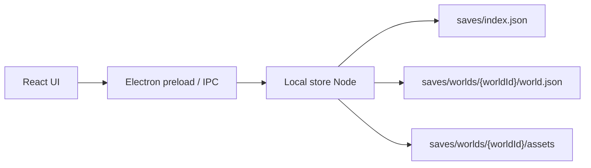

# VTT Lite: arquitetura local-first

## 1. Visao geral

O VTT Lite e uma mesa virtual leve para RPG. A prioridade atual e uma versao desktop local funcional: o mestre abre o programa, cria mundos, adiciona mapas/tokens e tudo fica salvo no disco da propria maquina.

Essa decisao combina melhor com o tipo de projeto: mapas e tokens podem ser arquivos pesados, o uso principal acontece durante sessoes locais/privadas e o produto nao precisa depender de hospedagem para funcionar.

## 2. Diferencial em relacao ao Foundry VTT

O Foundry VTT e poderoso, mas pode ser complexo para grupos iniciantes por exigir configuracao de servidor, portas, hospedagem ou conhecimento tecnico.

O VTT Lite deve buscar um caminho mais simples:

- abrir como um programa normal do Windows;
- salvar campanhas e imagens localmente;
- ter uma interface mais direta para o mestre;
- permitir evoluir para companion mobile quando a base desktop estiver estavel.

O diferencial nao e prometer tudo de uma vez. A ideia e reduzir atrito para grupos pequenos, com foco em usabilidade e controle local dos arquivos.

## 3. Arquitetura atual



### Desktop

- React + TypeScript + Vite para a interface.
- Electron como shell de programa local.
- IPC seguro entre a interface e o processo principal.
- Protocolo `vttlocal://` para carregar imagens salvas no disco.

### Persistencia local

Os dados ficam em `saves/`:

```text
saves/
  index.json
  worlds/
    {worldId}/
      world.json
      assets/
        {assetId}/
          mapa.png
```

O programa nao deve criar mundo, cena, token ou mapa de exemplo automaticamente.

### API Go

A API Go existe no repositorio, mas agora fica como camada opcional:

- testes de contrato;
- sincronizacao futura;
- ponte para companion mobile;
- possivel modo servidor para grupos remotos.

Ela nao e obrigatoria para o programa desktop local abrir e salvar mundos.

## 4. Estado atual implementado

- Launcher local sem mundo inicial.
- Criacao e exclusao de mundos locais.
- Criacao, edicao basica e exclusao de cenas.
- Upload e exclusao de assets locais.
- Aplicacao de mapa como fundo de cena.
- Chat local com scroll, envio de mensagem e rolagem.
- Mapa visual com grid e tokens criaveis/moviveis.
- Tokens podem ser criados sem imagem ou a partir de asset local do tipo `token`.

## 5. Proximos passos tecnicos

1. Persistir mensagens do chat no `world.json`.
2. Criar controle simples de iniciativa.
3. Melhorar editor de token: HP, CA, nome e imagem.
4. Melhorar configuracao de cena: grid, tamanho e imagem de fundo.
5. Empacotar o Electron como executavel instalavel.
6. Depois disso, retomar mobile/multiplayer com base local mais solida.

## 6. Estrutura do repositorio

```text
vtt-lite/
  apps/
    desktop-client/      # React + Electron
    mobile-companion/    # companion mobile planejado
  packages/
    srd-core/            # regras e dominio compartilhado
  server/                # API Go opcional/futura
  docs/                  # documentacao tecnica e academica
```
