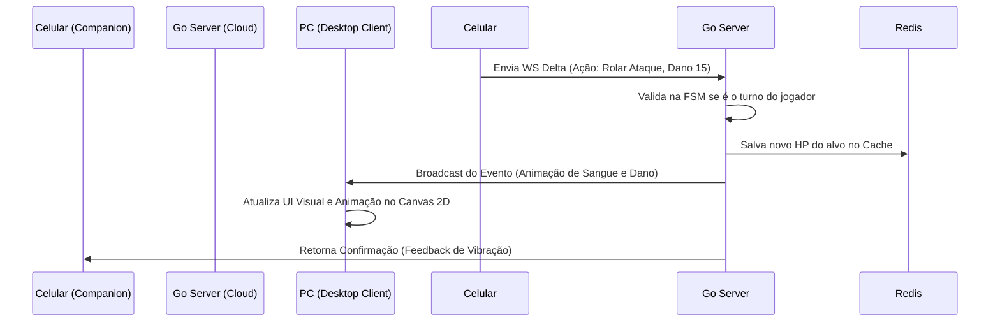

# Arquitetura: Mobile Companion App (PWA)

## A Visão (Segunda Tela)
O "Companion App" do VTT Lite é uma inovação desenhada para resolver o problema de poluição visual na tela principal do Mestre e dos Jogadores. Em vez de abrir abas, menus e janelas de inventário flutuando por cima do belo mapa 2D, o jogador faz toda a gestão de seu personagem através do celular.

## Experiência do Usuário (Fluxo de Conexão)

1. **Host via Desktop:** O Mestre (ou o próprio jogador) abre o client Desktop e entra em uma Sala.
2. **Gerenciamento de Dispositivo:** Na interface do PC, ele clica em "Conectar Celular".
3. **QR Code:** O Desktop gera um QR Code contendo uma URL profunda: `https://vttlite.app/join?roomId=123&token=abc`
4. **Instant Sync:** O jogador lê o código com a câmera do celular. O navegador mobile abre a aplicação React (PWA) e conecta ao WebSocket da mesma sala.
5. **State Reflected:** O celular carrega instantaneamente as informações da Ficha vinculadas àquele token de segurança.

## Stack Técnica

* **Framework:** React.js focado puramente em Mobile-First.
* **PWA (Progressive Web App):** A aplicação será instalável na tela inicial do iOS/Android diretamente pelo navegador, sem necessidade de publicação nas lojas de aplicativos (App Store / Google Play), mantendo o custo Zero.
* **WebSockets:** O client usará a API nativa do navegador ou Socket.io-client para manter um canal aberto com o servidor Go.
* **Feedback Tátil:** Usaremos a API de vibração do navegador (`navigator.vibrate`) para dar feedback tátil quando o jogador rola um dado crítico ou leva dano.

## Interface e Funcionalidades do Companion

1. **Aba de Status (Visão Rápida):**
   - HP Atual / Máximo (Barra grande e fácil de clicar para subtrair dano).
   - Armor Class (CA).
   - Status Effects (Envenenado, Cego).
2. **Aba de Ações (O Controle Remoto):**
   - Botão grande de "Ataque Principal" (Ex: Espada Longa). Ao clicar, o mobile envia um JSON via socket para o Go, que calcula e emite o evento para o Desktop animar a espada no grid.
   - Magias disponíveis (com slot tracking).
3. **Aba de Rolagem de Dados (Dice Roller):**
   - Teclado de dados (d4, d6, d8, d10, d12, d20).
   - Os resultados são calculados localmente (ou no servidor) e exibidos no log da tela do PC de todos.

## Diagrama de Fluxo (Comunicação)

## Próximos Passos
Na implementação, focaremos em desenhar componentes responsivos usando TailwindCSS e ShadcnUI, priorizando alvos de toque (touch targets) grandes, considerando que o jogador estará rolando dados e prestando atenção à tela principal ou aos amigos na mesa física.
